<a href="mailto:wsletcher@gmail.com?subject=Merging%20your%20pull%20request">
  <picture>
    <source media="(prefers-color-scheme: dark)" srcset="assets/hire-me-dark.svg">
    
  </picture>
</a>

<p align="center">
  <a href="mailto:wsletcher@gmail.com"></a>
  <a href="mailto:wsletcher@gmail.com"></a>
  <a href="https://www.sletchersystems.com"></a>
  
</p>

> [!NOTE]
> **The short version.** I'm Wayne, a full-stack and applied-AI developer in South Africa. I'll be direct: **I'm looking for work, and I can start this week.** Contract, freelance or full-time, remote. Everything below links to something you can check. **[wsletcher@gmail.com](mailto:wsletcher@gmail.com)**

**Closes:** the role you haven't filled yet. **Reviewers:** you.

## The defect

```js
backlog.length > team.capacity   // true, every sprint
```

## The change

Hey, I'm Wayne, a passionate coder and adventure-seeker 🏞️, and the creator of Sletcher Systems. I take a product from an empty repo to people paying for it, put AI in it that survives real users, and keep it running once it's live. I've also been a teacher, and it shows: in the docs, in how I hand over, and in PR bodies a maintainer can review in one pass.

## Tests

| test | pins | fails without the change |
|---|---|---|
| `ships_to_production` | [esl.sletchersystems.com](https://esl.sletchersystems.com), live and taking payments, built and run solo | **yes** |
| `merges_upstream` | [unslothai/unsloth#11142](https://github.com/unslothai/unsloth/pull/11142), merged into a 77k★ repo | **yes** |
| `survives_review` | three Windows fixes in review at [run-llama/llama_index](https://github.com/run-llama/llama_index/pulls?q=is%3Apr+author%3ASletch) (52k★) | **yes** |
| `writes_tests` | 1,200+ tests on the ESL platform, CI on every pull request | **yes** |
| `explains_it` | [Git From Zero](https://git-lesson.sletchersystems.com) and [Kubernetes & OpenShift](https://k8s.sletchersystems.com), both live | **yes** |
| `adventure_seeker` | the original 2024 README said so | no, by design (parity guard) |

## What's in this change

### 🗣️ The English System · [esl.sletchersystems.com](https://esl.sletchersystems.com)

English practice for A1 to B2 learners on mid-range Android phones over mobile data, built on my own teaching method. Design, code, payments and operations: all mine.

- **An AI guide on every page.** She knows which page you're standing on, speaks with a hosted voice, listens through the microphone, and takes you to the page you need instead of handing you a link. Her 15-stop tour for new learners costs zero AI calls, so it still works on a morning the AI provider is down.
- **A hands-free speaking partner with barge-in**, so you can interrupt it mid-sentence like you would a person.
- **Writing feedback, a grammar checker, and word games** with a global leaderboard.
- **Payments through PayFast** with campaign attribution carried through to the payments table, and access that ends when a paid period ends and not before.
- **Built for the bad day:** rate ceilings on every AI surface, fallbacks when a provider fails, a security log of what scanners throw at the site, and data retention that the privacy page promises and a daily job enforces.

`Next.js 16` `React 19` `TypeScript` `Supabase / Postgres` `Groq + Gemini` `Whisper` `Vercel` · 98 merged PRs · 1,200+ tests

### 🧪 Git From Zero · [git-lesson.sletchersystems.com](https://git-lesson.sletchersystems.com) · [code](https://github.com/banditofsmoke/01-git-and-github)

Takes you from never having opened a terminal to a merge conflict you caused on purpose and then fixed.

- The sandbox is a real state machine: commits form a DAG, a rebase leaves the originals behind as ghosts, and `reflog` really does recover what `reset --hard` threw away.
- An eleven-task exam graded on the repository's actual state, so any correct route passes and there's no string to copy.
- One HTML file that works offline. 87 assertions, zero dependencies.

### ☸️ Kubernetes & OpenShift · [k8s.sletchersystems.com](https://k8s.sletchersystems.com)

21 lessons, 5 browser sandboxes, and a real 3-node cluster you're meant to break.

- Every lesson blocks until you commit to a prediction, and wrong answers come back later as a revision queue.
- kind with Calico, on Kubernetes v1.34 to match OpenShift 4.21. Calico because kind's default CNI accepts NetworkPolicy objects and then silently ignores them.
- Ten chaos faults injected blind, sixteen drills, and 24 tests that re-prove every claim the course makes.

### 🏢 Sletcher Systems · [sletchersystems.com](https://www.sletchersystems.com)

My agency site, an applied-AI lab, in English, Afrikaans, isiXhosa and isiZulu.

- A three-question enquiry with no password, UTM and first-touch attribution, session analytics, and an admin dashboard.
- [Field notes](https://www.sletchersystems.com/notes): what went wrong on real products, what each fault cost, and the rule that came out of it.

`React` `Vite` `Vercel serverless` `Supabase` · 81 merged PRs

### 🎓 TeacherSletch · in build

A free learning platform for people changing career into software. Learners apply, then prove what they can do through gates, checked automatically on their own public repos.

- A bot checks each application, gives every applicant a unique folder maze with a code hidden inside, and sets an accepted student up from a single label.
- Checks run on every student push, no secret ever gets committed, and the curriculum's own rules are tests.

`Python` `pytest` `GitHub Actions` `Docker` · 33 merged PRs

## Upstream

LlamaIndex's CI never runs its tests on Windows, so the bugs that only exist there pile up quietly. I run them there.

- ✅ **Merged** · [unslothai/unsloth#11142](https://github.com/unslothai/unsloth/pull/11142)<br>
  Studio re-ran a GPU probe, which starts a whole new process, on every embedding call. A 10-document sync probed 31 times, and one user's log showed 274 probes in 186 seconds. I traced it to the earlier change that caused it, and now it probes once per backend.
- 🟡 **In review** · [run-llama/llama_index#23293](https://github.com/run-llama/llama_index/pull/23293)<br>
  The graph stores wrote backslashes into remote persist paths on Windows.
- 🟡 **In review** · [run-llama/llama_index#23292](https://github.com/run-llama/llama_index/pull/23292)<br>
  `CSVReader` and `RTFReader` read UTF-8 files as cp1252 on Windows.
- 🟡 **In review** · [run-llama/llama_index#23281](https://github.com/run-llama/llama_index/pull/23281)<br>
  `MediaResource` paths serialized differently on Windows than on Linux.

## Review notes: how I work

- **A test that fails without the change, or it isn't a fix.** Every PR I open says which tests would fail if you reverted it.
- **A fix for a class of bug sweeps the whole class.** I learned that from two outages five days apart, where one route got fixed and six identical routes didn't.
- **Write it down where the next person will actually read it.** Decisions, faults and what they cost live in the repo, not in my head.
- **I build AI-native, and I say so.** I use Claude Code and run it like a team: spec before code, small PRs, review before merge. That's how one person ships this much.

## Stack


## One consequence worth naming

- **My contribution graph here looks quiet.** The product code is private, on [@banditofsmoke](https://github.com/banditofsmoke): 98 merged PRs on The English System and 81 on the agency site. I'll happily walk you through any of it on a call.
- **I'm in South Africa, on UTC+2.** That covers Europe's whole working day and the US East Coast's morning.

## Prior art

<details>
<summary><b>The 2024 README, kept whole.</b> Everything I've built around since before any of the above.</summary>

<br>

**🚀 About me.** Hey, I'm Wayne, a passionate coder and adventure-seeker! 🏞️

- 🔧 Creator of Sletcher Systems and Global Defense Network
- 💡 Always exploring new technologies and pushing boundaries

**🛠️ Interests & Expertise.** I love building projects around:

- 💻 Object-oriented programming
- 🧠 RAG systems (from tiny to industry level)
- 🤖 LLMs and Uncensored LLMs
- 🚣‍♂️ Agentic reasoning crews and tools
- 📞 Function calling
- 📊 Data science, forecasting, time series, ontologies, mapping (10M+ lines)
- 🌐 Full stack apps and machines
- 📡 Real-time communications networks
- 🔒 Cybersecurity projects
- 📈 Smart contracts
- 🔑 Hexadecimal encryptions
- 📄 LaTeX PDF generation
- 📊 Multimodal models
- 💾 Memory and thread script management

</details>

## How to merge

<div align="center">

<a href="mailto:wsletcher@gmail.com?subject=Merging%20your%20pull%20request"></a>

**[wsletcher@gmail.com](mailto:wsletcher@gmail.com)** · [sletchersystems.com/enquire](https://www.sletchersystems.com/enquire)

<i>Let's connect and build something amazing together!</i>

</div>
